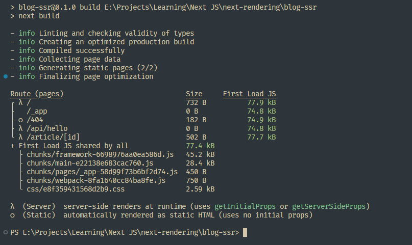
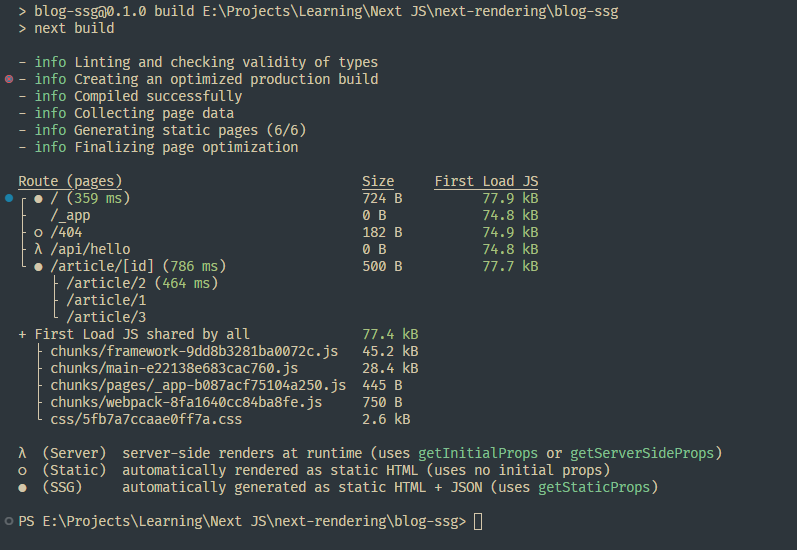
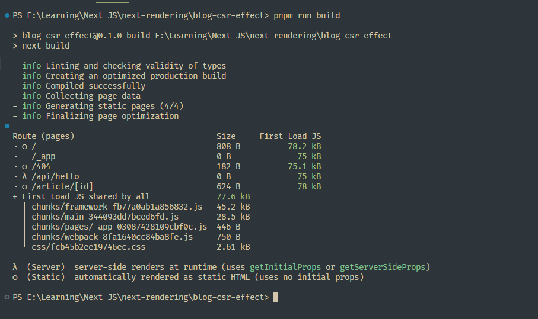

# Next-Rendering

An example repo containing Next JS rendering example projects

### Build Analysis

- Server Side Rendering (SSR)
  

- Static Site Generation (SSG)
  

- Client Side Rendering (`useEffect and useState`)
  
